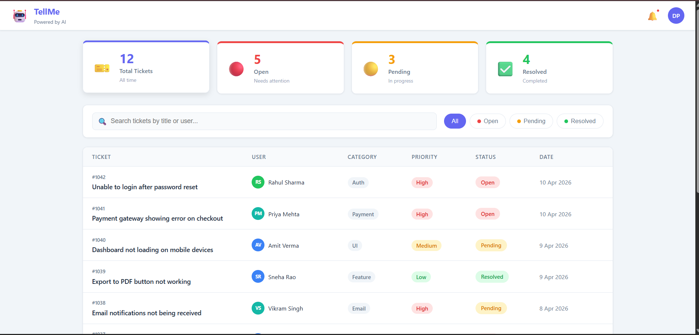

# 🤖 TellMe SupportAI Dashboard
A responsive AI-powered support ticket management dashboard built with React.js.

## 🌐 Live Demo
https://support-dashboard-theta.vercel.app

## 📸 Screenshot


## ✨ Features
- 📊 Real-time ticket statistics (Total, Open, Pending, Resolved)
- 🔍 Live search by ticket title or user name
- 🔘 Filter tickets by status (All, Open, Pending, Resolved)
- 📋 Expandable ticket rows with full details
- 📱 Fully responsive — works on mobile, tablet, desktop
- 🎨 Clean, accessible UI with priority and status color coding

## 🛠️ Tech Stack
- **React.js** — Component-based UI
- **JavaScript (ES6+)** — useState, array methods, destructuring
- **CSS3** — Flexbox, CSS Grid, CSS Variables, Responsive Design
- **Vercel** — Deployment

## 📁 Project Structure

```
Old Prject Structure v1.0.0
src/
├── components/
│   ├── Navbar.js        # Top navigation bar
│   ├── StatsCards.js    # Ticket count summary cards
│   ├── FilterBar.js     # Search + filter buttons
│   ├── TicketList.js    # List container
│   └── TicketCard.js    # Individual ticket row
├── data/
│   └── mockData.js      # Mock ticket data + helper functions
├── App.js               # Root component + state management
└── App.css              # Global styles + CSS variables
```

## 💡 React Concepts Used
- `useState` — managing search, filter, and expanded state
- Props — passing data from parent to child components
- Conditional rendering — showing empty state, expanded details
- List rendering — `.map()` to render ticket cards
- Controlled inputs — search input controlled by React state
- Component composition — reusable StatCard inside StatsCards

## 🔮 Planned Improvements or Releases

v1-0.0 - Release - Major
- The ticket system Frontend
- Static Webpage with Mock Data which is uneditable
- Responsive Webpage with Media query
- Static button placement with no working
- Full app webpage design and implementation

v2.0.0 - Release - Major
- Added Backend Using Spring 
- Dynamic List of the tickets where user has the full control now
- Now User can create the Ticket using the Create Button
- User can now update the Status of the ticket
- User can now Delete the ticket
- Added Loader on the Webapp
- Added Support for AI bot to analyze the ticket Priority,Tone of the User and Category for the tickets. ---> Major Feature for this Release
- Added Modal for Creation of the ticket which analyzes the ticket using AI
- Used gemini-2.5-flash to generate the response
- Major Improvements on the Stability and working of the app
- Deployed Backend on EC2 --> Major learning from this release

v-2.0.1 - Hotfix
-  Minor Improvments to prevent crashing of the app

Upcoming Features to be implemented

- [ ] Add JWT authentication
- [ ] Dark mode toggle
- [ ] Charts showing ticket trends (Chart.js)
- [ ] Pagination for ticket List
- [ ] User can update their Profile
- [ ] Dynamic Navbar
- [ ] Role Based Login Support

## 👨‍💻 Author
**Divyanshu Pal** — Full Stack Engineer | 2x AWS Certified
- LinkedIn: [linkedin.com/in/divyanshu_pal](https://linkedin.com/in/divyanshu_pal)