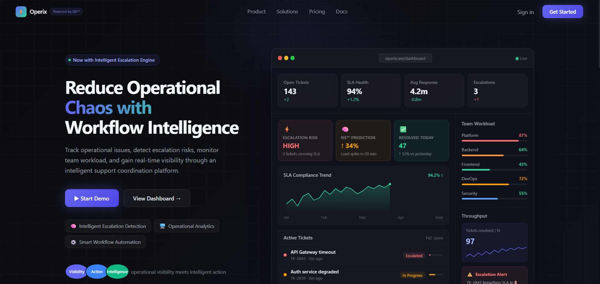

# Operix Operational Intellegince
A responsive IEE-powered support ticket and operational management dashboard built with React.js/Java.

## 🌐 Live Demo
https://support-dashboard-theta.vercel.app

## 📸 Screenshot
![Dashboard]

## ✨ Features
- 📊 Real-time ticket statistics (Total, Open, Pending, Resolved)
- 🔍 Live search by ticket title or user name
- 🔘 Filter tickets by status (All, Open, Pending, Resolved)
- 📋 Expandable ticket rows with full details
- 📱 Fully responsive — works on mobile, tablet, desktop
- 🎨 Clean, accessible UI with priority and status color coding

## 🛠️ Tech Stack
- **React.js** — Component-based UI
- **Java SpringBoot** — plsql,jwt,backend
- **JavaScript (ES6+)** — useState, array methods, destructuring
- **CSS3** — Flexbox, CSS Grid, CSS Variables, Responsive Design
- **Vercel** — Deployment

## 📁 Project Structure

```
Old Project Structure v1.0.0
src/
├── components/
│   ├── Navbar.js        # Top navigation bar
│   ├── StatsCards.js    # Ticket count summary cards
│   ├── FilterBar.js     # Search + filter buttons
│   ├── TicketList.js    # List container
│   └── TicketCard.js    # Individual ticket row
├── data/
│   └── mockData.js      # Mock ticket data + helper functions
├── App.js               # Root component + state management
└── App.css              # Global styles + CSS variables
```

New Project Structure v3.0.0
--Adding Soon

## 💡 React Concepts Used
- `useState` — managing search, filter, and expanded state
- Props — passing data from parent to child components
- Conditional rendering — showing empty state, expanded details
- List rendering — `.map()` to render ticket cards
- Controlled inputs — search input controlled by React state
- Component composition — reusable StatCard inside StatsCards
- Hooks — use for state management

## 🔮 Planned Improvements or Releases

v1-0.0 - Release - Major
- The ticket system Frontend
- Static Webpage with Mock Data which is uneditable
- Responsive Webpage with Media query
- Static button placement with no working
- Full app webpage design and implementation

v2.0.0 - Release - Major
- Added Backend Using Spring 
- Dynamic List of the tickets where user has the full control now
- Now User can create the Ticket using the Create Button
- User can now update the Status of the ticket
- User can now Delete the ticket
- Added Loader on the Webapp
- Added Support for AI bot to analyze the ticket Priority,Tone of the User and Category for the tickets. ---> Major Feature for this Release
- Added Modal for Creation of the ticket which analyzes the ticket using AI
- Used gemini-2.5-flash to generate the response
- Major Improvements on the Stability and working of the app
- Deployed Backend on EC2 --> Major learning from this release

v-2.0.1 - Hotfix
-  Minor Improvments to prevent crashing of the app
-  Minor unused imports removed for Vercel
-  Fixed CORS issue that blocked get Requests on Vercel using ngrock


## v-3.0.0 - Release - Major 
-  HomePage Experience
    Refined futuristic design language
    Cleaner operational data presentation
    Enhanced responsiveness across devices
    Improved visual hierarchy and spacing
    Better operational workflow storytelling
-  Dashboard Experience
    Completely redesigned futuristic workspace UI
    Improved dashboard performance
    Enhanced operational visibility layout
    Refined real-time activity feeds
    New intelligence-driven UI sections
-  Operational Analytics
    Live operational activity monitoring
    Queue pressure visualization
    Team workload intelligence
    SLA risk visibility improvements
    Enhanced operational metrics tracking
-  Introduced the new IEE™ (Intelligent Execution Engine) operational runtime
-  Redesigned the entire operational workspace experience
-  Added real-time workflow intelligence monitoring
-  Improved escalation detection and SLA visibility systems    

## 🔮 Upcoming Features to be implemented

- Authentication & Workspace Access
    Secure login and signup system
    JWT-based authentication
    OAuth integrations
    Multi-role workspace permissions
- IEE™ Runtime Activation
    Real-time operational intelligence engine
    Escalation risk detection
    SLA monitoring and prediction
    Intelligent operational recommendations
- Real-Time Operational Infrastructure
    Live operational activity feeds
    Real-time dashboard synchronization
    Queue monitoring systems
    Operational event processing
- Ticketing & Workflow System
    Full operational ticket lifecycle
    Smart ticket categorization
    Team assignment workflows
    Priority orchestration
    Automated escalation pipelines
- Operational Analytics Engine
    Queue pressure analytics
    Team performance visibility
    SLA health monitoring
    Operational trend analysis
    Workflow intelligence dashboards
- Integrations Ecosystem
    External operational APIs
- Security & Governance
    Controlled AI context orchestration
    Operational data protection layers
    Secure workflow boundaries
    Governance-aware intelligence routing
- Backend Infrastructure
    PostgreSQL operational architecture
    Redis live-state caching
    Event-driven processing system
    Background operational workers
    Scalable EC2 deployment runtime

## 👨‍💻 Author
**Divyanshu Pal** — Full Stack Engineer | 2x AWS Certified
- LinkedIn: [linkedin.com/in/divyanshu_pal](https://linkedin.com/in/divyanshu_pal)